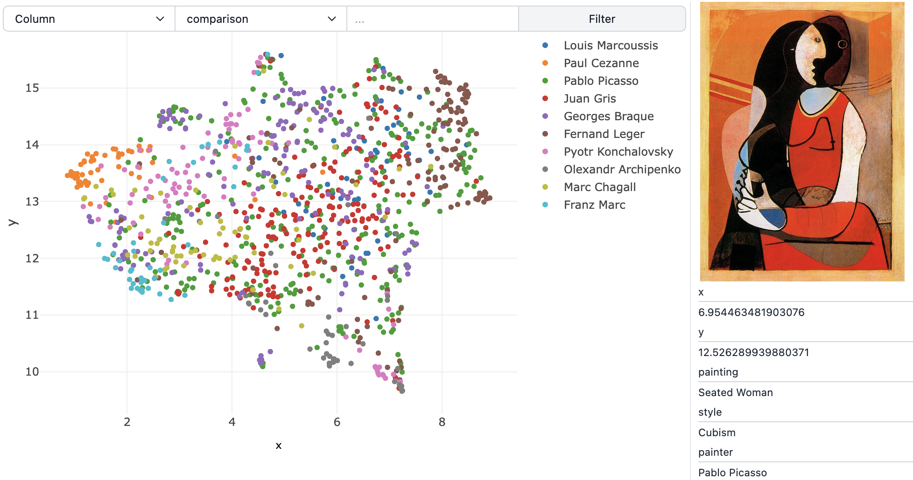
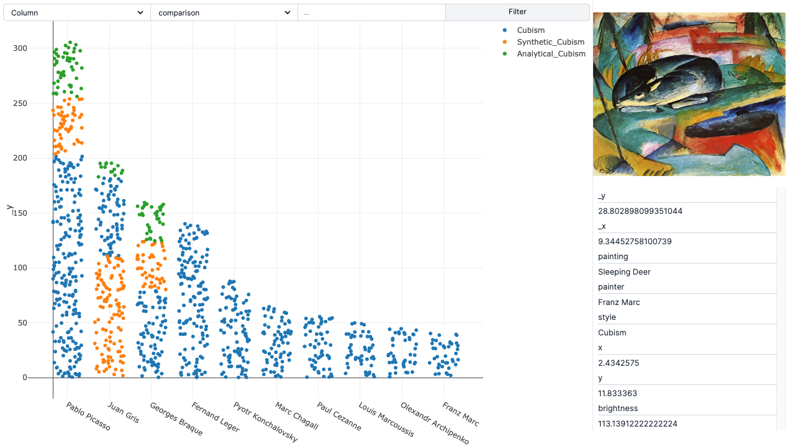
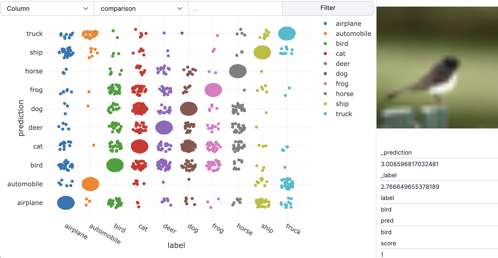
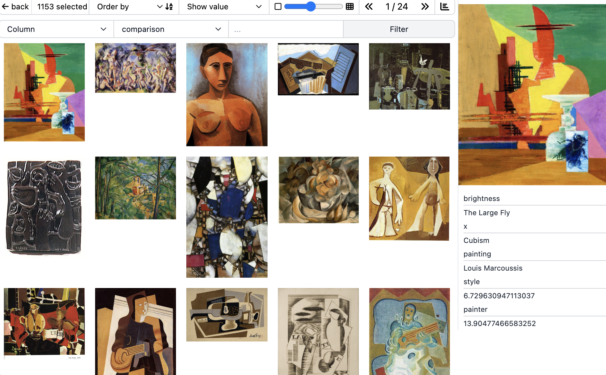
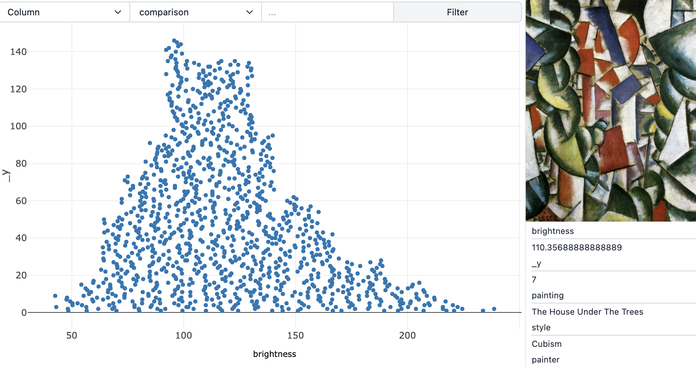
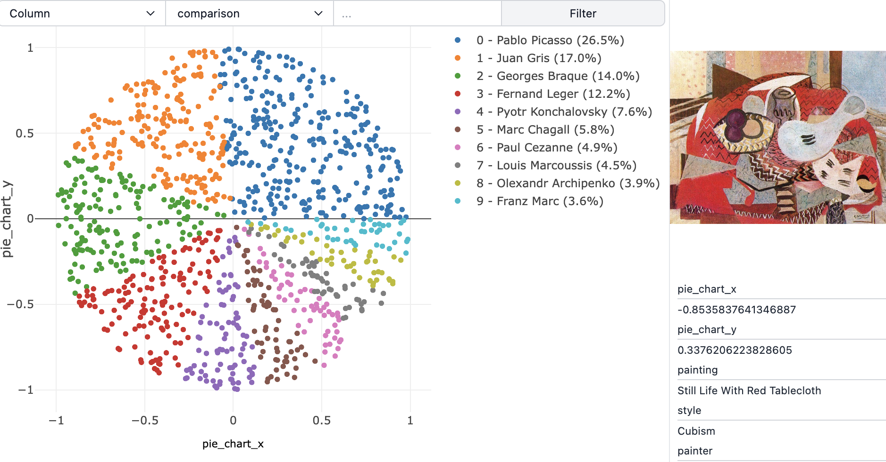
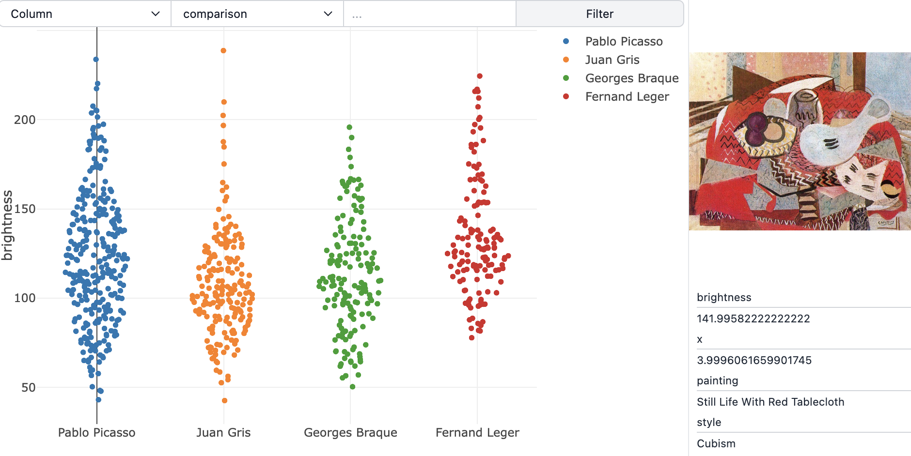

# Clusterfun

[Clusterfun](https://clusterfun.app) is a python plotting library to explore image and audio data. Play around with a live demo on [https://clusterfun.app](https://clusterfun.app).

- [Getting started](#getting-started)
- [A simple example](#a-simple-example)
- [Plotting](#plotting)
  - [Default parameters](#default-parameters)
  - [Plot types](#plot-types)
- [Labelling](#labelling)
  - [Applying labels](#applying-labels)
  - [Exporting labels](#exporting-labels)
- [Annotations](#annotations)
- [Embeddings & Similarity](#embeddings--similarity)
  - [Passing embeddings](#passing-embeddings)
  - [Similarity search](#similarity-search)
  - [2D embedding maps](#2d-embedding-maps)
- [Dataset Insights](#dataset-insights)
  - [Outlier detection](#outlier-detection)
  - [Duplicate detection](#duplicate-detection)
  - [Farthest from centroid](#farthest-from-centroid)
  - [Image statistics](#image-statistics)
- [Active Learning](#active-learning)
  - [Probe methods](#probe-methods)
- [Data loading](#data-loading)

## Getting started

Clusterfun can be installed with pip:

`pip install clusterfun`

Clusterfun requires Python 3.9 or higher.

Plots accept data in the form of a pandas DataFrame, which will be installed automatically if not already present.
No account, payment, or internet connection is required to use clusterfun. Clusterfun is open source and free to use.

## A simple example

```python
import pandas as pd
import clusterfun as clt

df = pd.read_csv("https://raw.githubusercontent.com/gietema/clusterfun-data/main/wiki-art.csv")
clt.scatter(df, x="x", y="y", media="img_path", color="painter")
```


Data can be hosted locally or on AWS S3.

As you can see, a clusterfun plot takes as input a pandas dataframe and column names indicating which columns to use for the visualisation. In this way, it is similar to the seaborn or the plotly library. But in clusterfun, you can:

- Click and drag to select data to visualise it in a grid
- Hover over data points to see them on the right side of the page
- Click on data points to view zoomed in versions of the image related to the data point

This makes clusterfun ideal for quickly visualising image data, which can be useful in the context of building datasets, exploring edge cases and debugging model performance.

## Plotting

### Default parameters

The default parameters shared across all plot types:

- `df: pd.DataFrame` (required)

  The dataframe used for the data to plot. Most other parameters are column names in this dataframe (e.g. media, color, etc.).

- `media: str` (required)

  The column name of the media to display in the plot. See [data loading](#data-loading) for more information about the type of media that can be displayed.

- `show: bool = True`

  Whether to show the plot or not. If show is set to True, clusterfun will start a local server to display the plot in a web browser. More specifically, we start a FastAPI server where we mount the webpage as a static file. The application itself does not require an internet connection. All data is loaded locally and does not leave your machine/browser.
  If show is set to False, clusterfun only saves the required data to serve the plot later on and return the path to where the data is stored. If you want to serve the plot yourself later on, you can run `clusterfun  {path - to - data}|{uuid}` in the command line to start a local server for the plot you are interested in.

- `color: Optional[str] = None`

  If given, points will be colored based on the values in the given column. Powerful for visualising clusters or classes of data.

- `title: Optional[str] = None`

  The title to use for the plot.

- `bounding_box: Optional[str] = None`

  You can visualise bounding boxes on top of your images by with the `bounding_box` parameter. For this to work, you need to have a bounding box column in the dataframe used to plot the data. Each cell in the dataframe needs to contain a dictionary or a list of dictionaries with bounding box values: xmin, ymin, xmax, ymax, label (optional), color (optional). The keys of the expected dictionary are:

  - `xmin: float | int`
  - `ymin: float | int`
  - `xmax: float | int`
  - `ymax: float | int`
  - `label: Optional[str] = None`
  - `color: Optional[str] = None`

  If no color is provided, a default color scheme will be used. The color value can be a color name or hex value. The label will be displayed in the top left of the bounding box.
  Example:

  ```python
  single_bounding_box = {
    "xmin": 12,
    "ymin": 10,
    "xmax": 100,
    "ymax": 110,
    "color": "green",
    "label": "ground truth"
  }
  ```

### Plot types

#### Bar chart

```python
clt.bar_chart(df, x="painter", media="img_path", color="style")
```

- `x: str` — column for the bar chart. One bar per unique value.
- `color: Optional[str]` — creates a stacked bar chart.



#### Confusion matrix

```python
clt.confusion_matrix(df, y_true="label", y_pred="pred", media="img_path")
```

- `y_true: str` — ground truth label column.
- `y_pred: str` — predicted label column.



#### Grid

```python
clt.grid(df, media="img_path")
```

Displays items in a browsable grid layout.



#### Histogram

```python
clt.histogram(df, x="brightness", media="img_path", bins=20)
```

- `x: str` — column for the histogram.
- `bins: int = 20` — number of bins.



#### Pie chart

```python
clt.pie_chart(df, color="painter", media="img_path")
```

- `color: str` — column for the pie slices.



#### Scatterplot

```python
clt.scatter(df, x="x", y="y", media="img_path")
```

- `x: str` — column for the x-axis.
- `y: str` — column for the y-axis.


#### Violin plot

```python
clt.violin(df, y="brightness", media="img_path")
```

- `y: str` — column for the y-axis.



## Labelling

Clusterfun includes a built-in labelling workflow for assigning labels to items directly in the UI.

### Applying labels

Select items in any plot or grid view, then use the label panel to assign a label. Labels are stored alongside the view data and can be used for filtering, active learning, and export.

- Select items by clicking/dragging on a plot or using the grid checkboxes
- Type a label name and press Enter to apply it
- Labels can be added or removed from any selection
- Undo/redo support for label actions

### Exporting labels

Labels can be exported as CSV or used to create new filtered grid views:

- **Download CSV** — exports media paths and their assigned labels
- **Save as grid** — creates a new view containing only the labelled items

## Annotations

Draw rectangle and polygon annotations directly on images in the detail view. Annotations are stored per-image and can be exported in bulk.

- **Rectangle tool** — click and drag to draw bounding boxes
- **Polygon tool** — click to place vertices, close the polygon by clicking the first point
- Each annotation has a label and optional color
- Export all annotations as JSON via the annotations export endpoint

## Embeddings & Similarity

Embedding-powered features require an `embeddings` column in your dataframe containing pre-computed embedding vectors.

### Passing embeddings

```python
clt.scatter(df, x="x", y="y", media="img_path", embeddings="embedding_col")
```

The `embeddings` parameter accepts a column name containing lists/arrays of floats. Once provided, similarity search, insights, and active learning features become available.

### Similarity search

Click any item to find its nearest neighbors in embedding space. Results are ranked by cosine similarity and displayed in a panel for quick browsing.

### 2D embedding maps

The plot builder can generate 2D embedding maps using dimensionality reduction:

- **UMAP** — preserves local structure, good for cluster visualization
- **t-SNE** — emphasizes local neighborhoods
- **PCA** — fast linear projection

## Dataset Insights

The Insights tab provides automated analysis of your dataset using column statistics and embeddings. For large datasets (> 10K items), analyses run in the background with progress tracking.

### Outlier detection

Uses Local Outlier Factor (LOF) to find items most different from their neighbors. Configurable parameters:

- **k neighbors** — number of neighbors for LOF (default: 20)
- **min score** — LOF threshold; lower values return more outliers (default: 1.5)
- **group by** — detect outliers within each group independently (e.g. per-class)

Scales to millions of items via FAISS approximate nearest neighbor search.

### Duplicate detection

Finds groups of near-duplicate items based on cosine similarity in embedding space.

- **threshold** — minimum similarity to consider a pair as duplicates (default: 0.95)
- Returns connected components grouped via union-find

### Farthest from centroid

Ranks items by cosine distance from the dataset centroid. Items at the top are the most unusual relative to the overall dataset. Uses streaming computation (no FAISS needed), so it works efficiently at any scale.

### Image statistics

Computes per-image statistics and adds them as new columns to the dataset:

- Brightness, contrast, sharpness, colorfulness, saturation
- Aspect ratio, width, height

Once computed, these columns appear in plots, filters, and column distributions.

## Active Learning

Label a small number of items, then let the active learning probe rank the rest of the dataset by relevance. The probe trains on your labelled embeddings and scores unlabeled items in streaming chunks.

### Probe methods

- **Centroid** — single-class: ranks by cosine similarity to the centroid of labelled items
- **Prototype** — multi-class: per-class centroids with softmax scoring
- **KNN** — builds a small FAISS index of labelled items, votes by weighted neighbors
- **Linear** — logistic regression (requires scikit-learn)
- **MLP** — multi-layer perceptron classifier (requires scikit-learn)

The method is auto-selected based on the number of label classes, or can be chosen manually. All methods stream through unlabeled items in 100K chunks to handle large datasets.

## Data loading

Clusterfun supports AWS S3, Google Cloud Storage, and local data storage.
The dataframe column corresponding to the media value in the plot will be used to determine where to load the media from.

```python
import clusterfun as clt

df = pd.read_csv("https://raw.githubusercontent.com/gietema/clusterfun-data/main/wiki-art.csv")
clt.grid(df, media="img_column")
```

- **Local files** — use relative or absolute file paths
- **AWS S3** — media paths should start with `s3://`. Set the `AWS_REGION` environment variable to the region where your data is stored.
- **Google Cloud Storage** — media paths should start with `gs://`. Install the optional `gcs` extra: `pip install clusterfun[gcs]`.
